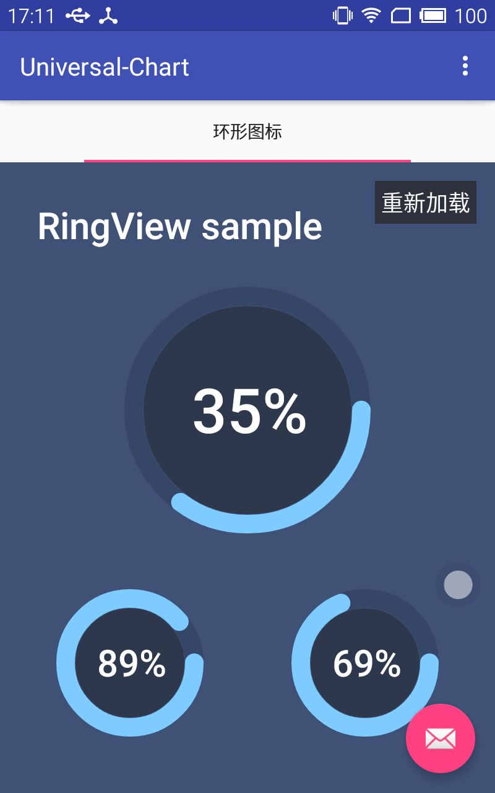

## 概述

用简单的方式，做好看的图表，这里的资源可能是仿照其他优秀项目写的，也可能是自己原始状态写出来的，但是会保证让你能够更容易理解的情况展示。

## 截图

## 进度

* 2016/01/09  RingView: 环形进度条，附带加载动画效果。

### RingView介绍
 环形进度条，支持动画加载效果
 
#### 参数说明

        <!--边框宽度-->
        <attr name="r_rect_width" format="dimension" />
        <!--边框颜色-->
        <attr name="r_rect_color" format="color" />
        <!--显示文字颜色-->
        <attr name="r_text_color" format="color" />
        <!--文字内容-->
        <attr name="r_text" format="string" />
        <!--内部的圆背景-->
        <attr name="r_bg_color" format="color" />
        <!--圆环填充背景-->
        <attr name="r_ring_bg_color" format="color" />
        <!--动画执行时长-->
        <attr name="r_ring_duration" format="integer" />

#### 使用说明

    <org.fireking.ui_component.ringview.RingView
        android:id="@+id/ringview2"
        android:layout_width="120dip"
        android:layout_height="120dip"
        android:layout_alignParentBottom="true"
        android:layout_margin="45dip"
        app:r_ring_duration="1800" />
        
#### 公共方法

*  public void setText(int progress);
设置进度显示数字，progress取值范围为0-100之间的数字。
 
## 更多效果还在开发中,敬请期待 ...